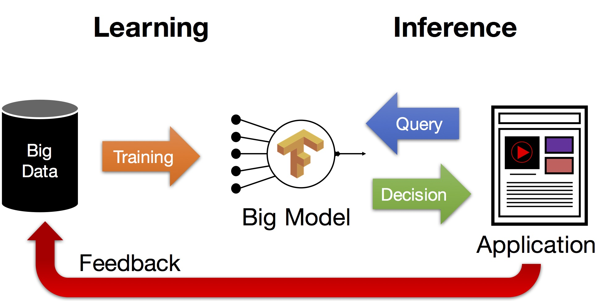

{:width="400px"}

While much of the focus of machine learning research is on the process of training models (i.e., learning) there are a unique set of challenges around the process of serving and updating those models that is often overlooked.  In this lecture we will explore the bigger machine learning life-cycle and discuss the challenges around serving predictions.

## Reading lists:

### Prediction Serving Systems [Daniel Crankshaw]

1. *Deepak Agarwal, Bo Long, Jonathan Traupman, Doris Xin, and Liang Zhang.* 2014. [**LASER: a scalable response prediction platform for online advertising.**](http://dl.acm.org/citation.cfm?id=2556252) In Proceedings of the 7th ACM international conference on Web search and data mining (WSDM '14).

#### Optional Reading

1. *Daniel Crankshaw, Xin Wang, Giulio Zhou, Michael J. Franklin, Joseph E. Gonzalez, Ion Stoica* [**Clipper: A Low-Latency Online Prediction Serving System**](assets/papers/clipper_latest_draft_nsdi.pdf). This paper is still under review.

1. *Daniel Crankshaw, Peter Bailis, Joseph E. Gonzalez, Haoyuan Li, Zhao Zhang, Michael J. Franklin, Ali Ghodsi, Michael I. Jordan* [**The Missing Piece in Complex Analytics: Low Latency, Scalable Model Management and Serving with Velox**](http://arxiv.org/abs/1409.3809). The Conference on Innovative Database Research (CIDR'2015).

### Managing the ML Lifecycle [Giulio Zhou]

1. *D. Sculley, Gary Holt, Daniel Golovin, Eugene Davydov, Todd Phillips, Dietmar Ebner, Vinay Chaudhary, Michael Young* 2014. [**Machine Learning: The High Interest Credit Card of Technical Debt**](http://research.google.com/pubs/pub43146.html). SE4ML: Software Engineering for Machine Learning (NIPS 2014 Workshop)

#### Optional Reading

1. *Xinran He, Junfeng Pan, Ou Jin, Tianbing Xu, Bo Liu, Tao Xu, Yanxin Shi, Antoine Atallah, Ralf Herbrich, Stuart Bowers, and Joaquin Quiñonero Candela.* 2014. [**Practical Lessons from Predicting Clicks on Ads at Facebook.**](http://dl.acm.org/citation.cfm?id=2648589) In Proceedings of the Eighth International Workshop on Data Mining for Online Advertising (ADKDD'14).

1. *H. Brendan McMahan, Gary Holt, D. Sculley, Michael Young, Dietmar Ebner, Julian Grady, Lan Nie, Todd Phillips, Eugene Davydov, Daniel Golovin, Sharat Chikkerur, Dan Liu, Martin Wattenberg, Arnar Mar Hrafnkelsson, Tom Boulos, and Jeremy Kubica.* [**Ad click prediction: a view from the trenches.**](http://dl.acm.org/citation.cfm?id=2488200) In Proceedings of the 19th ACM SIGKDD international conference on Knowledge discovery and data mining (KDD '13)

### Prematerialized Predictions [Noah Golmant]

1. *M. Levent Koc and Christopher Re* 2014. [**Incrementally Maintaining Classification Using an RDBMS**](http://dl.acm.org/citation.cfm?id=1952380) Proc. VLDB Endow. 4, 5 (February 2011).

## Question

<iframe src="https://docs.google.com/a/berkeley.edu/forms/d/e/1FAIpQLSc2oIL3H-1WcC10VJDKqK-2wab-U1YEubunNx6x8eVbRDAAkQ/viewform?embedded=true" width="760" height="600" frameborder="0" marginheight="0" marginwidth="0">Loading...</iframe>

<!-- {: style="text-align: center"} -->

